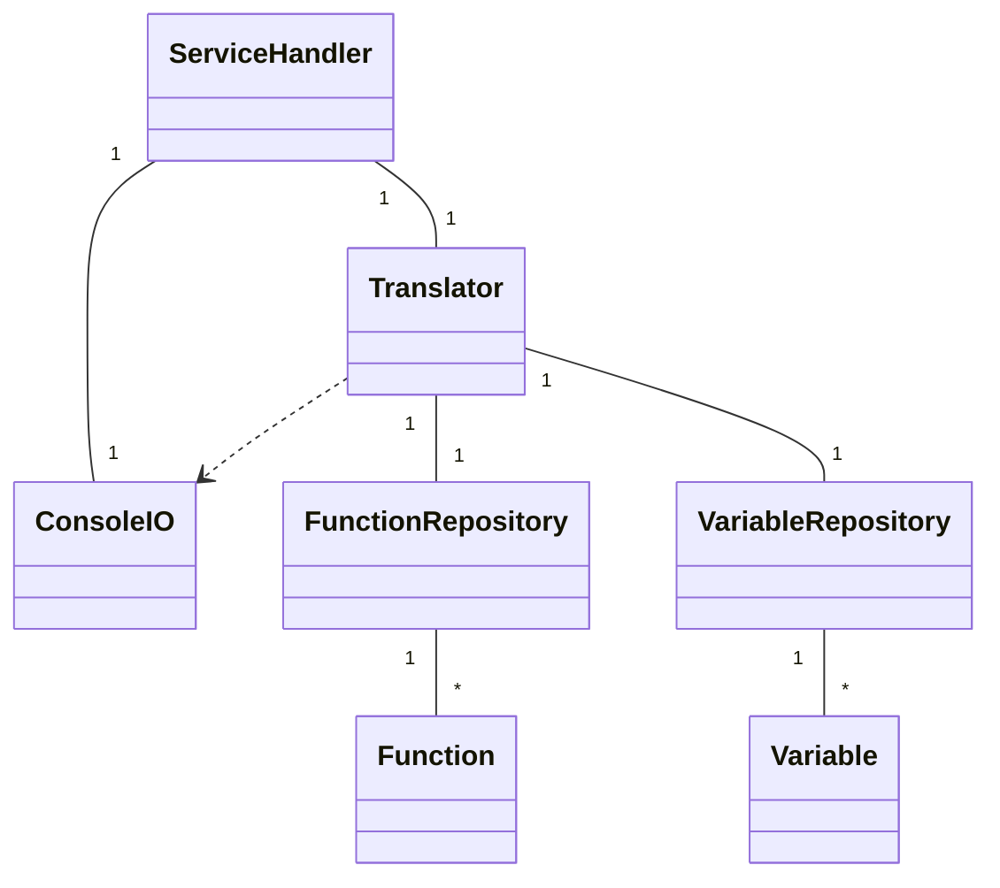
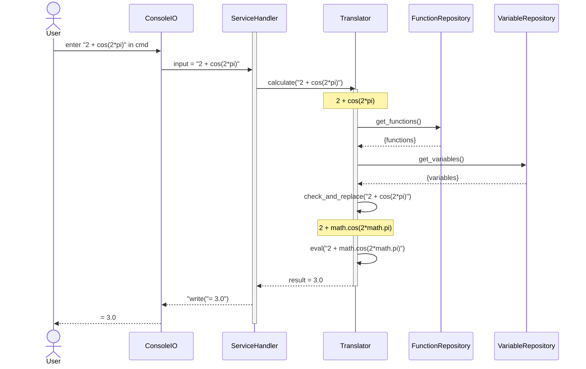

# Arkkitehtuuri
Sovelluksen arkkitehtuuriin liittyvää tietoa

## Sovelluslogiikka

```mermaid
 classDiagram
    ServiceHandler "1" -- "1" ConsoleIO
    ServiceHandler "1" -- "1" Translator
    Translator "1" -- "1" FunctionRepository
    Translator "1" -- "1" VariableRepository
    Translator ..> ConsoleIO
    FunctionRepository "1" -- "*" Function
    VariableRepository "1" -- "*" Variable
```

## Toiminnallisuudet
Eri toiminnallisuuksiin liittyviä kaavioita

### Laskutoimituksen laskeminen

```mermaid
 sequenceDiagram
   activate ServiceHandler
   actor User
   participant ConsoleIO
   participant ServiceHandler
   participant Translator
   participant FunctionRepository
   participant VariableRepository
   User->>ConsoleIO: enter "2 + cos(2*pi)" in cmd
   ConsoleIO->>ServiceHandler: input = "2 + cos(2*pi)"
   ServiceHandler->>Translator: calculate("2 + cos(2*pi)")
   activate Translator
   Note over Translator: 2 + cos(2*pi)
   Translator->>FunctionRepository: get_functions()
   FunctionRepository-->>Translator: {functions}
   Translator->>VariableRepository: get_variables()
   VariableRepository-->>Translator: {variables}
   Translator->>Translator: check_and_replace("2 + cos(2*pi)")
   Note over Translator: 2 + math.cos(2*math.pi)
   Translator->>Translator: eval("2 + math.cos(2*math.pi)")
   Translator-->>ServiceHandler: result = 3.0
   deactivate Translator
   ServiceHandler-->>ConsoleIO: "write("= 3.0")
   ConsoleIO-->>User: = 3.0
   deactivate ServiceHandler
```
