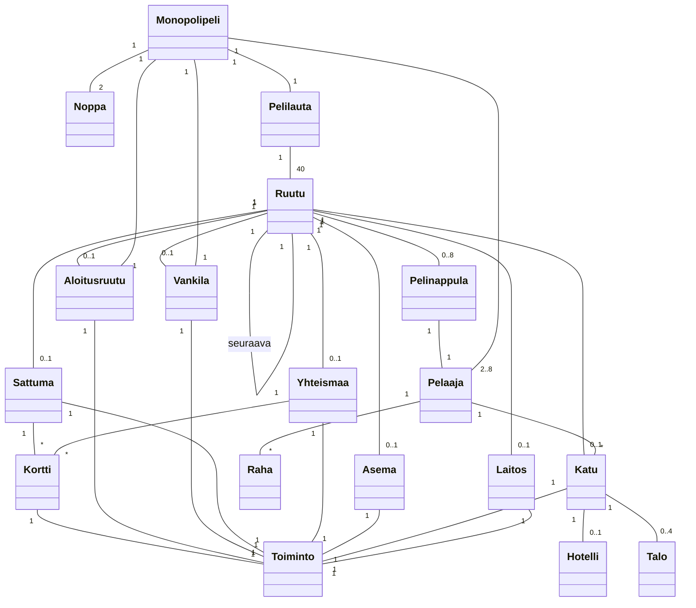

## Monopoli luokkakaavio

```mermaid
 classDiagram
    Monopolipeli "1" -- "2" Noppa
    Monopolipeli "1" -- "1" Pelilauta
    Pelilauta "1" -- "40" Ruutu
    Ruutu "1" -- "1" Ruutu : seuraava
    Ruutu "1" -- "0..1" Aloitusruutu
    Ruutu "1" -- "0..1" Vankila
    Ruutu "1" -- "0..1" Sattuma
    Ruutu "1" -- "0..1" Yhteismaa
    Ruutu "1" -- "0..1" Asema
    Ruutu "1" -- "0..1" Laitos
    Ruutu "1" -- "0..1" Katu
    Monopolipeli "1" -- "1" Aloitusruutu
    Monopolipeli "1" -- "1" Vankila
    Sattuma "1" -- "*" Kortti
    Yhteismaa "1" -- "*" Kortti
    Kortti "1" -- "1" Toiminto
    Aloitusruutu "1" -- "1" Toiminto
    Vankila "1" -- "1" Toiminto
    Sattuma "1" -- "1" Toiminto
    Yhteismaa "1" -- "1" Toiminto
    Asema "1" -- "1" Toiminto
    Katu "1" -- "1" Toiminto
    Laitos "1" -- "1" Toiminto
    Ruutu "1" -- "0..8" Pelinappula
    Katu "1" -- "0..1" Hotelli
    Katu "1" -- "0..4" Talo
    Pelaaja "1" -- "*" Katu
    Pelaaja "1" -- "*" Raha
    Pelinappula "1" -- "1" Pelaaja
    Pelaaja "2..8" -- "1" Monopolipeli
```
